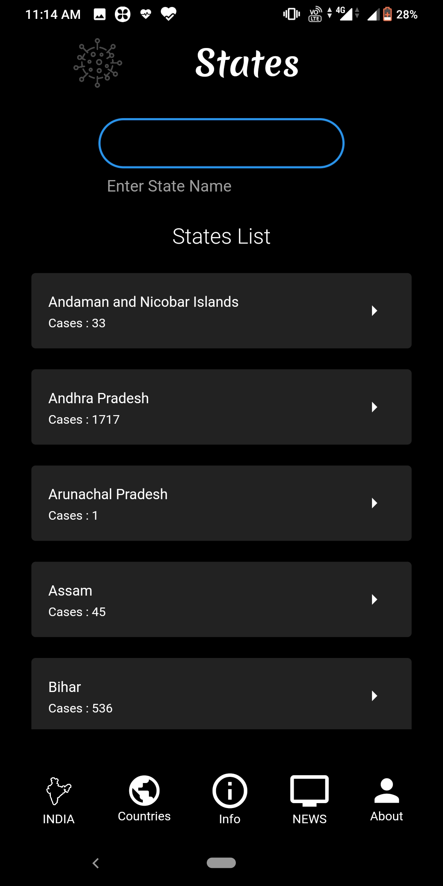
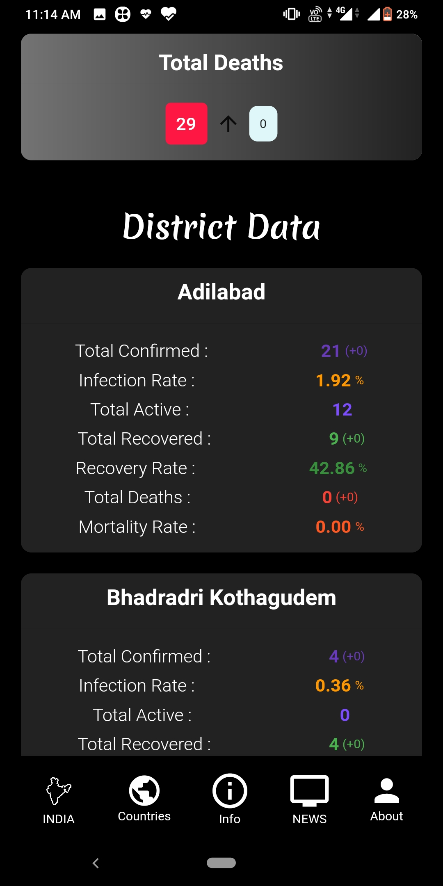
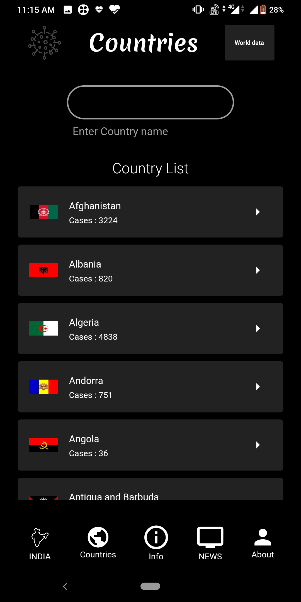
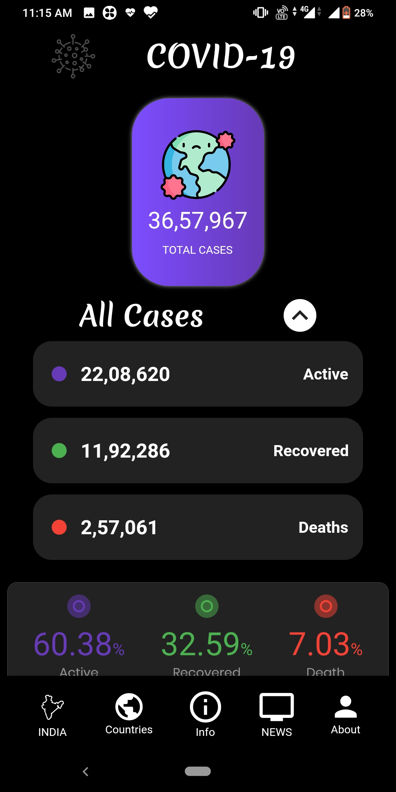
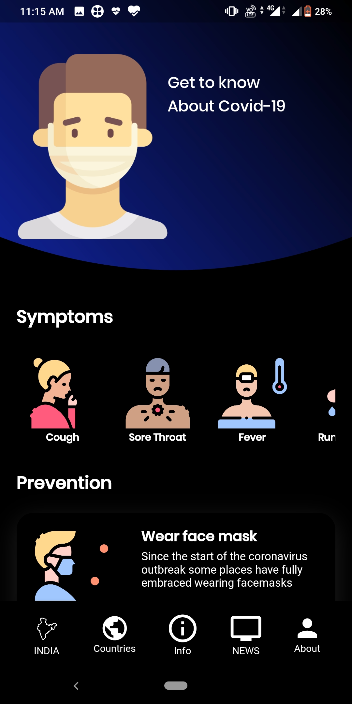
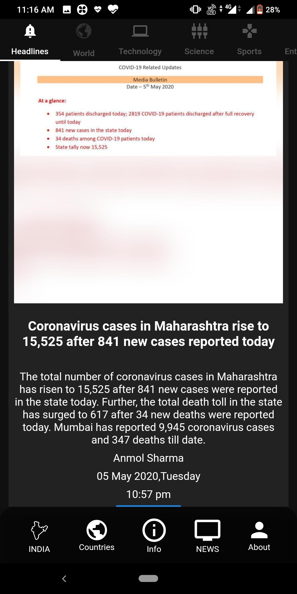

# covid19-tracker

Covid-19 Tracker is free and Open Source, Cross Platform web and Android Application developed using [Flutter](https://github.com/flutter/flutter).
Download the Latest version from the below links.

## Go to the website
[Covid19-tracker link](https://covid19ind-updates.netlify.app/#/)

## Download the App

## About

Covid-19 Tracker tracks the active, recovered and deaths due to corona virus all over the world and updates daily.  
This Web/Mobile application allows you to select different countries and States of India to obtain the results. For India along with the states individual data, even the district data can be accessed.

Along with the Statistics of Covid-19 it also gives Latest NEWS in the news section which are further sub divided into various sections like Headlines, technology, Entertainment etc.

## Screenshots

## Credits  
- [COVID-19 API](https://covid19api.com/) for country and world data.
- [COVID19-India API](https://api.covid19india.org/) for India data.
- [NEWS API](https://github.com/cyberboysumanjay/Inshorts-News-API) for Latest News.
- [Rendi Ramadana](https://www.uplabs.com/posts/coronavirus-information-concept) and [Abu Anwar](https://github.com/abuanwar072/Covid-19-Flutter-UI) for UI design.
